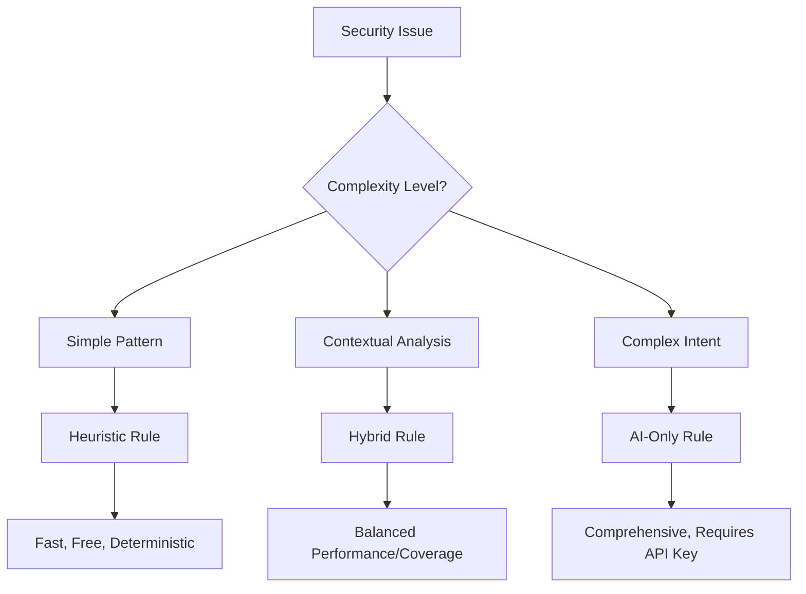

# TavoAI Rule Development Guide

## Overview

This guide provides comprehensive instructions for developing, testing, and maintaining TavoAI security rules. Whether you're creating new rules or modifying existing ones, this guide covers the entire rule lifecycle.

## Getting Started

### Prerequisites

1. **Repository Access**: Clone the `tavo-rules` repository
2. **Python Environment**: Python 3.8+ with required dependencies
3. **Understanding**: Familiarity with YAML, security concepts, and AI/LLM risks

```bash
git clone https://github.com/tavoai/tavo-rules.git
cd tavo-rules
pip install -r requirements.txt
```

### Development Workflow

1. **Plan**: Identify the security issue and target frameworks
2. **Design**: Choose rule type (heuristic/hybrid/AI-only)
3. **Implement**: Write the rule in YAML format
4. **Test**: Validate against sample code and measure quality metrics
5. **Document**: Add comprehensive descriptions and remediation guidance
6. **Review**: Peer review and security validation
7. **Deploy**: Package and distribute via bundle system

## Rule Design Principles

### 1. Security-First Approach

- **Accuracy Over Speed**: Correct detection is more important than performance
- **False Positive Minimization**: Avoid flagging safe code
- **Standards Compliance**: Include relevant CWE/CAPEC/OWASP mappings
- **Remediation Focus**: Provide actionable fix recommendations

### 2. Cost-Effective AI Usage

- **Heuristics First**: Use fast pattern matching to filter before AI analysis
- **Smart Triggers**: Only run AI when heuristics indicate potential issues
- **Caching**: Leverage result caching to reduce API calls
- **Fallback Models**: Use cheaper models for basic analysis

### 3. Maintainable Rules

- **Clear Intent**: Rule purpose should be obvious from name and description
- **Comprehensive Testing**: Include both positive and negative test cases
- **Version Control**: Use semantic versioning
- **Documentation**: Detailed explanations and examples

## Rule Types

### Choosing the Right Rule Type



#### Heuristic Rules (opengrep/OPA)

**Best For**: Simple pattern matching, known vulnerability signatures, compliance checks

**Characteristics**:
- ✅ Fast execution (no API calls)
- ✅ Deterministic results
- ✅ Works offline
- ❌ Limited to pattern matching
- ❌ Can't understand code intent

**Example Use Cases**:
- SQL injection pattern detection
- Hardcoded secrets
- Missing security headers
- Basic input validation checks

#### Hybrid Rules (Heuristics + AI)

**Best For**: Issues requiring both pattern detection and contextual analysis

**Characteristics**:
- ✅ Fast pre-filtering with heuristics
- ✅ Deep analysis with AI for complex cases
- ✅ Cost-effective (AI only when needed)
- ✅ Best of both worlds

**Example Use Cases**:
- Prompt injection detection
- Access control validation
- Data leakage prevention
- Bias detection in ML models

#### AI-Only Rules

**Best For**: Complex issues requiring deep code understanding and intent analysis

**Characteristics**:
- ✅ Maximum analysis depth
- ✅ Handles ambiguous cases
- ✅ Contextual understanding
- ❌ Requires API key
- ❌ Slower execution
- ❌ More expensive

**Example Use Cases**:
- Advanced bias detection
- Code intent analysis
- Complex vulnerability chains
- Policy compliance validation

## Rule Development Process

### Step 1: Define the Security Issue

```yaml
# Start with clear problem definition
problem: "LLM applications vulnerable to prompt injection attacks"
impact: "Attackers can manipulate AI behavior, extract sensitive data, or bypass security controls"
affected_languages: ["python", "javascript", "typescript", "java", "go"]
common_patterns:
  - Direct user input in prompts
  - String concatenation in prompt construction
  - Missing input sanitization
  - Trusting LLM outputs without validation
```

### Step 2: Research Standards and Frameworks

```yaml
# Map to relevant security standards
standards:
  cwe: ["CWE-1395"]                    # Dependency on Vulnerable Third-Party Component
  capec: ["CAPEC-550"]                 # Install New Service (prompt manipulation)
  owasp_llm: ["LLM01"]                 # Prompt Injection
  iso_42001: ["7.5.1"]                 # Information security (data protection)
  nist_ai_rmf: ["MEASURE-2.1"]         # AI system measurement
```

### Step 3: Design Heuristics

Start with pattern-based detection:

```yaml
# Python prompt injection patterns
patterns:
  - name: "direct_user_input"
    pattern: |
      prompt = f"Tell me about {user_input}"
      response = llm.generate(prompt)
    severity: "high"
    message: "User input directly inserted into LLM prompt"

  - name: "string_concatenation"
    pattern: |
      prompt = "Answer this: " + user_input
      result = model.predict(prompt)
    severity: "high"
    message: "User input concatenated into prompt string"

  - name: "missing_validation"
    pattern: |
      # Look for prompt construction without validation
      prompt = construct_prompt(request.args.get('query'))
      # No validation of query parameter
    severity: "medium"
    message: "Prompt constructed from unvalidated input"
```

### Step 4: Design AI Analysis (for Hybrid Rules)

Define what AI should analyze:

```yaml
ai_analysis_scope:
  - "Input validation effectiveness"
  - "Prompt sanitization robustness"
  - "Jailbreak attempt detection"
  - "Privilege escalation potential"
  - "Data exfiltration risks"
  - "Output validation requirements"

prompt_template: |
  You are a senior security engineer specializing in LLM security.

  Analyze this code for prompt injection vulnerabilities:

  ```{language}
  {code_snippet}
  ```

  Context: {file_path} (line {line_number})
  Heuristic alerts: {heuristic_findings}

  Evaluate the following aspects:

  1. **Input Sources**: Are all prompt inputs validated and sanitized?
  2. **Prompt Construction**: Is prompt building secure against injection?
  3. **Jailbreak Detection**: Could inputs contain jailbreak attempts?
  4. **Output Handling**: Is LLM output validated before use?
  5. **Privilege Context**: Could injection lead to privilege escalation?

  Provide analysis with specific code locations, severity assessment,
  and actionable remediation steps.
```

### Step 5: Write the Rule

Use the templates from the `templates/` directory:

```bash
# Copy appropriate template
cp templates/hybrid-rule-template.yaml rules/my-new-rule.yaml

# Edit with your rule content
vim rules/my-new-rule.yaml
```

### Step 6: Validate the Rule

```bash
# Validate YAML syntax and schema compliance
python scripts/validate-rules.py rules/my-new-rule.yaml

# Test against sample code
python scripts/test-rules.py --rule rules/my-new-rule.yaml

# Check SARIF output
python scripts/generate-sarif.py --rule rules/my-new-rule.yaml --test-results test-results.json
```

### Step 7: Create Test Samples

```bash
# Create vulnerable test sample
cat > tests/samples/vulnerable/prompt_injection.py << 'EOF'
def vulnerable_function(user_input):
    # This is vulnerable to prompt injection
    prompt = f"Translate this to French: {user_input}"
    response = openai.ChatCompletion.create(
        model="gpt-3.5-turbo",
        messages=[{"role": "user", "content": prompt}]
    )
    return response.choices[0].message.content
EOF

# Create safe test sample
cat > tests/samples/safe/prompt_injection.py << 'EOF'
def safe_function(user_input):
    # This is safe - input is validated
    if not isinstance(user_input, str) or len(user_input) > 1000:
        raise ValueError("Invalid input")

    # Sanitize input
    sanitized_input = user_input.replace('"', '\"').replace("'", "\'")

    prompt = f"Translate this to French: {sanitized_input}"
    response = openai.ChatCompletion.create(
        model="gpt-3.5-turbo",
        messages=[{"role": "user", "content": prompt}]
    )
    return response.choices[0].message.content
EOF
```

## Rule Quality Metrics

### Required Quality Standards

```yaml
quality_requirements:
  # Detection Accuracy
  true_positive_rate: "> 90%"      # Correctly identifies vulnerabilities
  false_positive_rate: "< 10%"     # Avoids flagging safe code

  # Performance
  heuristic_coverage: "> 80%"      # Heuristics catch most cases
  ai_accuracy: "> 95%"             # AI analysis is highly accurate
  execution_time: "< 30s"          # Rule completes within timeout

  # Maintainability
  documentation_completeness: "100%"  # Full descriptions and examples
  test_coverage: "100%"             # All code paths tested
  standards_mapping: "complete"     # All relevant standards included
```

### Measuring Quality

```bash
# Run comprehensive quality assessment
python scripts/test-rules.py --rule rules/my-rule.yaml --quality-report

# Expected output:
# True Positive Rate: 95.2%
# False Positive Rate: 3.1%
# Heuristic Coverage: 87.3%
# AI Analysis Accuracy: 97.8%
# Execution Time: 12.3s
# Overall Quality Score: 93.2/100
```

## Common Patterns and Anti-Patterns

### Good Patterns

```yaml
# ✅ Clear, specific patterns
patterns:
  - pattern: |
      # Specific vulnerability signature
      eval(user_input)
    message: "Dangerous use of eval() with user input"

# ✅ Comprehensive standards mapping
standards:
  cwe: ["CWE-95"]      # Eval Injection
  capec: ["CAPEC-77"]  # Manipulating User-Controlled Variables
  owasp: ["A03:2021-Injection"]

# ✅ Actionable remediation
remediation: |
  Replace eval() with safe alternatives:
  - Use JSON.parse() for data parsing
  - Implement whitelist validation
  - Use safe evaluation libraries
```

### Anti-Patterns to Avoid

```yaml
# ❌ Too broad patterns (high false positives)
patterns:
  - pattern: ".*input.*"  # Matches everything

# ❌ Vague messages
message: "Potential issue found"  # Not actionable

# ❌ Missing standards mapping
standards: {}  # No security framework references

# ❌ Poor AI prompts
prompt_template: "Check this code for problems"  # Too vague

# ❌ No test cases
# Rule has no corresponding test samples
```

## Bundle Organization

### Bundle Structure

```bash
bundles/ai-enhanced/owasp-llm-pro/
├── manifest.json          # Bundle metadata and artifacts list
├── rules/                 # Individual rule files
│   ├── llm01-prompt-injection.yaml
│   ├── llm02-insecure-output-handling.yaml
│   └── ...
├── README.md             # Bundle documentation
├── CHANGELOG.md          # Version history
└── tests/                # Bundle-specific tests
    └── samples/          # Test code samples
```

### Manifest Creation

```json
{
  "id": "tavoai-owasp-llm-pro",
  "name": "TavoAI OWASP LLM Top 10 Pro",
  "description": "Advanced OWASP LLM Top 10 rules with AI-powered analysis",
  "version": "1.0.0",
  "artifact_type": "code_rule",
  "pricing_tier": "paid",
  "author": "TavoAI",
  "license": "Proprietary",
  "artifacts": [
    "rules/llm01-prompt-injection.yaml",
    "rules/llm02-insecure-output-handling.yaml",
    "rules/llm03-training-data-poisoning.yaml",
    "rules/llm04-model-denial-of-service.yaml",
    "rules/llm05-supply-chain-vulnerabilities.yaml",
    "rules/llm06-sensitive-information-disclosure.yaml",
    "rules/llm07-insecure-plugin-design.yaml",
    "rules/llm08-excessive-agency.yaml",
    "rules/llm09-overreliance.yaml",
    "rules/llm10-model-theft.yaml"
  ],
  "standards": {
    "owasp_llm": ["LLM01", "LLM02", "LLM03", "LLM04", "LLM05", "LLM06", "LLM07", "LLM08", "LLM09", "LLM10"]
  },
  "languages": ["python", "javascript", "typescript", "java", "go"],
  "tags": ["owasp", "llm", "ai-security", "comprehensive"]
}
```

## Testing and Validation

### Automated Testing

```bash
# Test entire bundle
python scripts/test-rules.py --bundle owasp-llm-pro

# Validate all rules in bundle
python scripts/validate-rules.py bundles/ai-enhanced/owasp-llm-pro/

# Generate SARIF report
python scripts/generate-sarif.py --bundle owasp-llm-pro --output results.sarif
```

### Manual Testing

```bash
# Test against your own code
tavoai scan --bundle owasp-llm-pro --local /path/to/your/code

# Test with AI analysis (requires API key)
tavoai scan --bundle owasp-llm-pro --api-key YOUR_KEY /path/to/code
```

## Deployment and Distribution

### Packaging Bundles

```bash
# Package single bundle
./scripts/package-bundle.sh owasp-llm-pro

# Package all bundles
./scripts/package-bundle.sh --all

# Output: .tavoai-bundle files ready for distribution
```

### Publishing to Registry

```bash
# Upload to TavoAI Registry (requires API key)
tavoai registry upload owasp-llm-pro-1.0.0.tavoai-bundle

# Or publish via GitHub releases for free bundles
gh release create v1.0.0 owasp-llm-basic-1.0.0.tavoai-bundle
```

## Maintenance and Updates

### Version Management

```yaml
# Semantic versioning
version: "1.0.0"    # Major.Minor.Patch
  # Major: Breaking changes
  # Minor: New features, backward compatible
  # Patch: Bug fixes, backward compatible
```

### Regular Updates

1. **Monitor New Threats**: Stay updated on emerging AI security issues
2. **Update Patterns**: Refine heuristics based on real-world feedback
3. **Enhance AI Prompts**: Improve AI analysis based on accuracy metrics
4. **Add Test Cases**: Include new vulnerability patterns as they're discovered
5. **Update Standards**: Include new CWE/CAPEC/OWASP mappings

### Changelog Management

```markdown
# Changelog

## [1.1.0] - 2025-11-20
### Added
- LLM11: New OWASP LLM category support
- Enhanced jailbreak detection patterns

### Fixed
- Reduced false positives in prompt injection detection
- Improved AI prompt accuracy for complex scenarios

### Changed
- Updated AI model compatibility list
- Optimized token usage for cost efficiency
```

## Troubleshooting

### Common Issues

**Rule Not Detecting Known Vulnerabilities**
```bash
# Debug heuristic patterns
python scripts/test-rules.py --rule rules/my-rule.yaml --verbose

# Check pattern syntax
semgrep --validate rules/my-rule.yaml
```

**High False Positive Rate**
```bash
# Analyze false positives
python scripts/test-rules.py --rule rules/my-rule.yaml --analyze-fp

# Refine patterns to be more specific
# Add context conditions to reduce false matches
```

**AI Analysis Inconsistent**
```bash
# Check AI prompt clarity
# Add more specific examples in prompt template
# Increase temperature for more deterministic responses
```

**Performance Issues**
```bash
# Profile rule execution
python scripts/test-rules.py --rule rules/my-rule.yaml --profile

# Optimize patterns for better performance
# Add caching directives for repeated analysis
```

## Resources

### Templates
- `templates/heuristic-only-template.yaml` - Basic pattern matching
- `templates/hybrid-rule-template.yaml` - Full hybrid rule
- `templates/ai-only-template.yaml` - Pure AI analysis

### Examples
- `bundles/ai-enhanced/owasp-llm-pro/rules/` - Production rule examples
- `tests/samples/` - Test case examples

### Documentation
- `docs/hybrid-format-spec.md` - Complete format specification
- `docs/ai-prompt-engineering.md` - AI prompt best practices
- `docs/cwe-capec-mapping.md` - Standards mapping guide

### Tools
- `scripts/validate-rules.py` - Rule validation
- `scripts/test-rules.py` - Rule testing
- `scripts/generate-sarif.py` - SARIF output generation

## Contributing

1. Follow the development workflow above
2. Ensure all tests pass with >90% accuracy
3. Include comprehensive documentation
4. Get peer review before submitting
5. Update CHANGELOG.md with changes

## Support

- **Documentation**: Check `docs/` directory first
- **Issues**: File GitHub issues with rule details
- **Discussions**: Use GitHub discussions for rule design questions
- **Security**: Report security issues privately to security@tavoai.com
